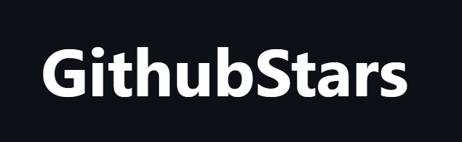

  

  

  

  

  <a aria-label="try fortstatus" href="https://github-stars-akinncar.vercel.app/"><b>Try in the Browser</b></a>

## Objective

The objective of this project is to create a web app that be possible to find starred repositories from a user and can manage retrieved repositories tags (i.e., add, edit, delete)

## Documentation

The documentation was builded with [Docussaurus v2](https://v2.docusaurus.io/) and was made to can show developers how to get start with this project in local machine. Docs website also have an API Reference session containing all endpoints available on back-end. The website are [available here](https://github-stars-docs.vercel.app/).

## Technologies

To develop this application, a monorepo was created with [Yarn Workspaces](https://classic.yarnpkg.com/en/docs/workspaces/) to manage the Server and Client sides. This technologies was picked thinking in all ecosystem of this project focused in Javascript/Typescript. Both packages are hosted and have an automated CI/CD. You can see all technologies used in README of each project. Also, you will see all Production URL's bellow:

- [Production Back-end](https://github-stars-api-akinncar.herokuapp.com/) - [README](./packages/server/README.md)
- [Production Front-end](https://github-stars-akinncar.vercel.app/) - [README](./packages/client/README.md)
- [Production Documentation](https://github-stars-docs.vercel.app/) - [README](./packages/docs/README.md)

## License

The app's source code is made available under the [MIT license](LICENSE). Some of the dependencies are licensed differently, with the BSD license, for example.

## Contact

Akinn Rosa - [Github](https://github.com/akinncar) - **[akinncar@hotmail.com](mailto:akinncar@hotmail.com)**
